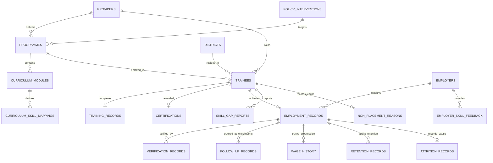

# Skilling Impact Intelligence Platform — Admin Relational Data Model Specification

**Document Version:** 2.0 (Authoritative Implementation)  
**Scope:** Admin / Government Analytics Experience  
**Underlying Relational Dataset:** Exactly 800 Longitudinal Trainee Records  
**Deterministic Seed:** `Mulberry32(42)`  

---

## 1. Architectural Overview & Relational Integrity

The **Skilling Impact Intelligence Platform** operates on a unified relational schema designed specifically to measure, trace, and audit longitudinal skilling and employment outcomes. Every analytical metric presented on the Admin dashboard and subordinate analytics screens originates from this relational model.

---

## 2. Core Relational Entities

### 2.1 `TRAINEES`
Primary entity representing citizens registered in the National Skilling Framework.
- **Table Name:** `trainees`
- **Total Population:** 800 Records (`TR-0001` through `TR-0800`)
- **Fields:**
  - `id` (VARCHAR(16), PK): Stable permanent identifier (e.g., `TR-0142`).
  - `name` (VARCHAR(128)): Full trainee name.
  - `gender` (ENUM): `'Female'`, `'Male'`, `'Other'`. (46% Female, 50% Male, 4% Other).
  - `age` (INTEGER): Age between 19 and 32 years.
  - `age_group` (ENUM): `'18-21'`, `'22-25'`, `'26-30'`, `'31+'`.
  - `category` (ENUM): Social category: `'General'`, `'OBC'`, `'SC'`, `'ST'`.
  - `programme_id` (VARCHAR(16), FK -> `programmes.id`): Enrolled course.
  - `programme_name` (VARCHAR(128)): Denormalized course title for high-speed indexing.
  - `provider_id` (VARCHAR(16), FK -> `providers.id`): Assigned training provider.
  - `provider_name` (VARCHAR(128)): Denormalized training partner title.
  - `district` (VARCHAR(64), FK -> `districts.name`): Geographic home district.
  - `cohort` (VARCHAR(16), FK -> `cohorts.code`): Enrolment batch (e.g., `'2024-Q1'`).
  - `training_status` (ENUM): `'Completed'`, `'Dropped Out'`.
  - `certified` (BOOLEAN): State certification status.
  - `assessment_score` (INTEGER): Final certification assessment percentage (40–98).
  - `certificate_id` (VARCHAR(32), Nullable): Formal credential identifier.

---

### 2.2 `PROGRAMMES`
Skilling curricula delivered across accredited vocational centers.
- **Table Name:** `programmes`
- **Total Records:** 5 Key Technical & Vocational Programmes
- **Fields:**
  - `id` (VARCHAR(16), PK): e.g., `PRG-001`.
  - `name` (VARCHAR(128)): Course designation.
  - `sector` (VARCHAR(64)): Industry classification (IT, Healthcare, Automotive, Clean Energy).
  - `duration_weeks` (INTEGER): Instructional length (14–24 weeks).
  - `target_proficiency` (INTEGER): Minimum expected benchmark score (75–90%).
- **Records:**
  1. `PRG-001`: Cloud Infrastructure & DevOps (IT Sector, 16 weeks, 85% Target)
  2. `PRG-002`: Full Stack Web Engineering (IT Sector, 20 weeks, 80% Target)
  3. `PRG-003`: Automotive Precision & EV Systems (Automotive Sector, 24 weeks, 85% Target)
  4. `PRG-004`: Patient Care & Healthcare Operations (Healthcare Sector, 16 weeks, 90% Target)
  5. `PRG-005`: Renewable Energy & Solar Grid (Green Energy Sector, 14 weeks, 80% Target)

---

### 2.3 `PROVIDERS`
Accredited training partners and vocational hubs.
- **Table Name:** `providers`
- **Total Records:** 5 Authoritative Training Organizations
- **Fields:**
  - `id` (VARCHAR(16), PK): e.g., `PRV-001`.
  - `name` (VARCHAR(128)): Institution title.
  - `type` (VARCHAR(64)): Institutional model (Industry CSR, Foundation, Specialized Institute).
  - `district` (VARCHAR(64), FK -> `districts.name`): HQ location.
  - `placement_bias` (FLOAT): Latent statistical tendency governing placement outcomes.
- **Records:**
  1. `PRV-001`: TATA STRIVE (Industry CSR, High placement + High retention)
  2. `PRV-002`: Tech Mahindra Foundation (CSR Foundation, High placement + Strong wage progression)
  3. `PRV-003`: Don Bosco Tech Society (Vocational NGO, High completion + Moderate placement)
  4. `PRV-004`: Apollo MedSkills Institute (Specialized Healthcare, High certification + High relevance)
  5. `PRV-005`: Schneider Electric Training Centre (Industry Center, High technical wages)

---

### 2.4 `DISTRICTS`
Geographic administrative districts across the implementation state.
- **Table Name:** `districts`
- **Total Records:** 6 Strategic Districts
- **Fields:**
  - `id` (VARCHAR(16), PK): e.g., `DST-001`.
  - `name` (VARCHAR(64), Unique): District title.
  - `region` (VARCHAR(64)): Economic cluster (Metropolitan, Industrial, Agrarian/Suburban).
  - `placement_multiplier` (FLOAT): Local industrial job density factor (0.82–1.18).
- **Records:**
  1. `DST-001`: Mumbai (Metropolitan Hub, Tech concentration, High baseline wage)
  2. `DST-002`: Pune (Industrial & IT Corridor, Balanced placement & wage growth)
  3. `DST-003`: Nagpur (Eastern Logistic Hub, Higher transport/relocation non-placement)
  4. `DST-004`: Nashik (Agritech & Manufacturing Cluster, Moderate wage growth)
  5. `DST-005`: Thane (Suburban Industrial Cluster, Strong absorption)
  6. `DST-006`: Guntur (Tier-2 Strategic Hub, High healthcare & solar uptake)

---

### 2.5 `EMPLOYERS`
Registered industry hiring partners employing certified trainees.
- **Table Name:** `employers`
- **Total Records:** 8 Authoritative Employers
- **Fields:**
  - `id` (VARCHAR(16), PK): e.g., `EMP-001`.
  - `name` (VARCHAR(128)): Corporate entity name.
  - `sector` (VARCHAR(64)): Industry classification.
  - `location` (VARCHAR(64)): Primary corporate headquarters.
  - `retention_rate_benchmark` (FLOAT): Historical 6-month retention rate.
  - `status` (ENUM): `'Verified'`, `'Pending'`, `'Rejected'`.
- **Records:**
  1. `EMP-001`: Infosys Technologies (IT Services, Pune)
  2. `EMP-002`: Tata Consultancy Services (Enterprise Cloud, Mumbai)
  3. `EMP-003`: Wipro Technologies (Web Engineering, Mumbai)
  4. `EMP-004`: Apollo Hospitals Enterprise (Healthcare, Guntur)
  5. `EMP-005`: Fortis Healthcare (Clinical Services, Mumbai)
  6. `EMP-006`: Tata Motors Ltd (EV Systems, Pune)
  7. `EMP-007`: Mahindra Electric Mobility (Automotive, Nashik)
  8. `EMP-008`: Tata Power Solar Systems (Clean Energy, Nagpur)

---

### 2.6 `EMPLOYMENT_RECORDS`
Longitudinal outcome records capturing formal employment, self-employment, and apprenticeships.
- **Table Name:** `employment_records`
- **Relationship:** 1:1 or 1:0 with `trainees`
- **Fields:**
  - `id` (VARCHAR(16), PK): e.g., `EMP-REC-0142`.
  - `trainee_id` (VARCHAR(16), FK -> `trainees.id`).
  - `status` (ENUM): `'EMPLOYED'`, `'SELF_EMPLOYED'`, `'APPRENTICESHIP'`, `'UNEMPLOYED'`.
  - `employer_id` (VARCHAR(16), Nullable, FK -> `employers.id`).
  - `employer_name` (VARCHAR(128), Nullable).
  - `designation` (VARCHAR(128), Nullable).
  - `joining_date` (DATE, Nullable).
  - `starting_wage` (INTEGER, Nullable): Monthly wage at Day 1 (₹14,000–₹32,000).
  - `current_wage` (INTEGER, Nullable): Monthly wage at current observation (₹15,000–₹42,000).
  - `verification_status` (ENUM): `'VERIFIED'`, `'PENDING'`, `'UNVERIFIED'`.
  - `verification_source` (ENUM): `'EPFO_API'`, `'EMPLOYER_PORTAL'`, `'DOCUMENT_PAYSLIP'`.
  - `skill_relevance_score` (INTEGER): Assessed job-skill alignment (0–100%).

---

### 2.7 `FOLLOW_UP_RECORDS`
Longitudinal outreach checkpoints conducted post-placement.
- **Table Name:** `follow_up_records`
- **Relationship:** 1:N with `employment_records`
- **Checkpoints:** 3 Months, 6 Months, 12 Months
- **Fields:**
  - `id` (VARCHAR(16), PK): e.g., `FOL-0142-3M`.
  - `trainee_id` (VARCHAR(16), FK -> `trainees.id`).
  - `checkpoint` (ENUM): `'3M'`, `'6M'`, `'12M'`.
  - `status` (ENUM): `'Completed'`, `'Scheduled'`, `'Pending'`.
  - `conducted_date` (DATE).
  - `employed_at_checkpoint` (BOOLEAN).
  - `reported_wage` (INTEGER).
  - `notes` (TEXT).

---

### 2.8 `WAGE_HISTORY`
Chronological progression of monthly earnings across longitudinal milestones.
- **Table Name:** `wage_history`
- **Relationship:** 1:N with `employment_records`
- **Milestones:** Day 1 (First Job), 3-Month, 6-Month, 12-Month
- **Fields:**
  - `id` (VARCHAR(16), PK): e.g., `WG-0142-6M`.
  - `trainee_id` (VARCHAR(16), FK -> `trainees.id`).
  - `checkpoint` (ENUM): `'First Job'`, `'3M'`, `'6M'`, `'12M'`.
  - `wage_amount` (INTEGER): Monthly basic + HRA in Indian Rupees (₹).
  - `verified_via` (VARCHAR(32)): e.g., `'EPFO / Form 16'`.

---

### 2.9 `RETENTION_RECORDS`
Audit trail of continuous employment status post-placement.
- **Table Name:** `retention_records`
- **Relationship:** 1:1 with `employment_records`
- **Fields:**
  - `trainee_id` (VARCHAR(16), PK, FK -> `trainees.id`).
  - `retention_3m` (ENUM): `'Retained'`, `'Attracted/Moved'`, `'Attrited'`, `'Ineligible'`.
  - `retention_6m` (ENUM): `'Retained'`, `'Attrited'`, `'Ineligible'`.
  - `retention_12m` (ENUM): `'Retained'`, `'Attrited'`, `'Ineligible'`.
  - `milestone_completed` (VARCHAR(16)): Highest verified milestone.

---

### 2.10 `SKILL_GAP_REPORTS` & `EMPLOYER_SKILL_FEEDBACK`
Dual-source diagnostic records of observed technical and vocational deficits.
- **Trainee Reports:** Citations by trainees regarding workplace competencies requiring upskilling.
- **Employer Feedback:** Citations by enterprise managers and HR evaluators.
- **Fields:**
  - `id` (VARCHAR(16), PK).
  - `trainee_id` (VARCHAR(16), FK -> `trainees.id`).
  - `skill` (VARCHAR(64)): Deficit title (e.g., `'Kubernetes & Containerization'`).
  - `reported_by` (ENUM): `'Trainee'`, `'Employer'`.
  - `programme_id` (VARCHAR(16), FK -> `programmes.id`).
  - `severity` (ENUM): `'Critical'`, `'Moderate'`, `'Minor'`.

---

### 2.11 `NON_PLACEMENT_REASONS`
Root-cause records for certified trainees who have not secured employment.
- **Fields:**
  - `id` (VARCHAR(16), PK).
  - `trainee_id` (VARCHAR(16), FK -> `trainees.id`).
  - `category` (ENUM):
    - `'Location / Transport issues'`
    - `'Expectation Mismatch (Wages)'`
    - `'Pursuing Higher Education'`
    - `'Family / Personal constraints'`
    - `'Skill Gap identified in interview'`
    - `'Health reasons'`

---

### 2.12 `ATTRITION_RECORDS`
Root-cause records for placed trainees who exited employment before 12 months.
- **Fields:**
  - `id` (VARCHAR(16), PK).
  - `trainee_id` (VARCHAR(16), FK -> `trainees.id`).
  - `category` (ENUM):
    - `'Better opportunity'`
    - `'Low initial compensation'`
    - `'Skill expectation mismatch'`
    - `'Relocation / Transport issues'`
    - `'Working conditions'`
    - `'Contract ended'`
    - `'Personal reasons'`

---

### 2.13 `COHORTS`
Academic batches dividing trainees longitudinally.
- **Codes:** `'2024-Q1'`, `'2023-Q4'`, `'2023-Q3'`, `'2023-Q2'`.
- **Longitudinal Windows:**
  - `2024-Q1`: Recent graduates (Day 1 & 3M observations available).
  - `2023-Q4`: Intermediate cohort (Day 1, 3M, 6M observations available).
  - `2023-Q3` & `2023-Q2`: Mature cohorts (Full 12M longitudinal lifecycle available).

---

### 2.14 `CURRICULUM_MODULES` & `CURRICULUM_SKILL_MAPPINGS`
Fine-grained syllabus breakdown connecting modules to workplace competencies.
- **Structure:** `Programme -> Module -> Skill -> Target Proficiency -> Observed Proficiency -> Gap`.
- **Analytical Metrics:**
  - `Target Proficiency`: Syllabus threshold (75–90%).
  - `Observed Proficiency`: Aggregate assessment & employer validation score.
  - `Gap`: Delta indicating curriculum alignment deficit.

---

### 2.15 `DEMAND_DATA` & `SUPPLY_DATA`
Macro-economic labour market intelligence matrix.
- **Attributes:**
  - `Skill`: Evaluated competence.
  - `Training Supply`: Normalized state trainees producing this skill per annum.
  - `Industry Demand`: Unfilled job openings registered with the state labour exchange.
  - `Net Gap`: `Demand - Supply`.
  - `Priority Level`: `'Critical'`, `'High'`, `'Balanced'`, `'Surplus'`.

---

### 2.16 `POLICY_INTERVENTIONS`
Evidence-linked state policy interventions dynamically recommended when skill gaps, attrition, or placement deficits cross critical thresholds.
- **Actions:** Adopt, Review, Dismiss (persisted to reactive state).

---

## 3. Foreign Key Integrity Summary

| Entity | Primary Key | Foreign Keys | Cascading Dependencies |
| :--- | :--- | :--- | :--- |
| `trainees` | `id` | `programme_id`, `provider_id`, `district`, `cohort` | `employment_records`, `certifications`, `skill_gaps` |
| `employment_records` | `id` | `trainee_id`, `employer_id` | `wage_history`, `retention_records`, `follow_ups`, `attrition` |
| `certifications` | `certificate_id` | `trainee_id`, `programme_id` | Verified credentials |
| `wage_history` | `id` | `trainee_id` | Longitudinal wage curves |
| `retention_records` | `trainee_id` | `trainee_id` | 3M, 6M, 12M retention rates |
| `follow_up_records` | `id` | `trainee_id` | Audit outreach records |
| `curriculum_mapping`| `module_code` | `programme_id` | Observed proficiency calculations |
| `employer_verifications`| `id` | `employer_id`, `trainee_id` | Official verification oversight |

All entities resolve bi-directionally, ensuring zero orphaned records across the 800 trainee dataset.
