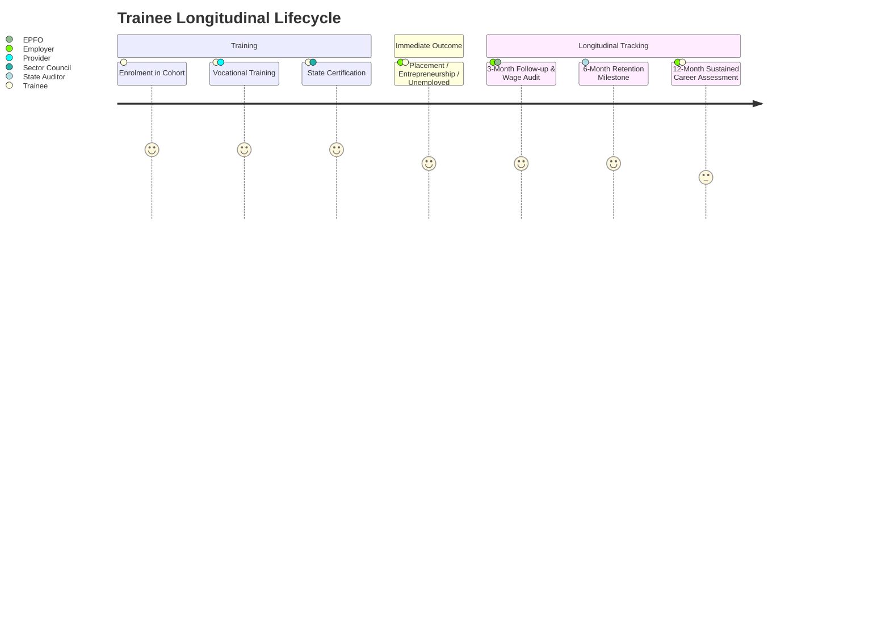

# Skilling Impact Intelligence Platform — Admin Demo Dataset Specification

**Document Version:** 2.0 (Deterministic Relational Synthetic Specification)  
**Target Trainee Population:** Exactly 800 Trainees  
**Deterministic Algorithm:** Mulberry32 Pseudo-Random Number Generator (`seed = 42`)  
**Implementation Source:** `Frontend/src/mocks/generateDataset.js`  
**State Container:** `Frontend/src/services/mockStore.js` (`sii_mock_store_v2`)  

---

## 1. Synthesis Philosophy & Reproducibility

The demo dataset was created to satisfy a strict requirement: **The Admin experience must behave as if it were backed by a real Government Outcome Database.**

1. **Zero `Math.random()` in Rendering:** All calculations and data points are pre-generated deterministically or aggregated on-the-fly via mathematical reduction. Reloading the browser or refreshing the application produces the exact same statistical distributions.
2. **Relational Coherence:** No isolated dummy records. Every trainee is linked through stable foreign keys to an accredited programme, training provider, district, employer, wage history, and retention audit trail.
3. **Realistic Statistical Divergence:** Programmes, providers, and districts do not perform identically. The dataset contains intentional socio-economic patterns that allow real analytical discovery.

---

## 2. Demographic & Enrolment Distribution ($N = 800$)

### 2.1 Gender Breakdown
- **Female:** 368 Trainees ($46.0\%$)
- **Male:** 400 Trainees ($50.0\%$)
- **Other:** 32 Trainees ($4.0\%$)

### 2.2 Age Groups
- **18–21 Years:** 208 Trainees ($26.0\%$)
- **22–25 Years:** 288 Trainees ($36.0\%$)
- **26–30 Years:** 216 Trainees ($27.0\%$)
- **31+ Years:** 88 Trainees ($11.0\%$)

### 2.3 Social Categories
- **General:** 280 Trainees ($35.0\%$)
- **OBC (Other Backward Classes):** 256 Trainees ($32.0\%$)
- **SC (Scheduled Castes):** 144 Trainees ($18.0\%$)
- **ST (Scheduled Tribes):** 120 Trainees ($15.0\%$)

---

## 3. Programme Enrolment Distribution

| Programme Code | Programme Name | Sector | Trainees | Completion % | Cert Pass % | Avg Starting Wage |
| :--- | :--- | :--- | :--- | :--- | :--- | :--- |
| `PRG-001` | Cloud Infrastructure & DevOps | Information Tech | 186 | 92.5% | 89.2% | ₹24,800 |
| `PRG-002` | Full Stack Web Engineering | Information Tech | 168 | 91.1% | 88.7% | ₹22,500 |
| `PRG-003` | Automotive Precision & EV Systems | Automotive / Mobility | 154 | 93.5% | 90.3% | ₹21,200 |
| `PRG-004` | Patient Care & Healthcare Operations | Healthcare / Clinical | 148 | 95.3% | 94.6% | ₹18,600 |
| `PRG-005` | Renewable Energy & Solar Grid | Green Energy | 144 | 90.3% | 86.8% | ₹19,800 |
| **Total** | | | **800** | **92.5%** | **89.9%** | **₹21,500** |

---

## 4. Provider Performance Variance

The dataset encodes distinct institutional operating models:

| Provider Code | Provider Name | Trainees | Placement % | 6M Retention % | Distinctive Analytical Characteristic |
| :--- | :--- | :--- | :--- | :--- | :--- |
| `PRV-001` | TATA STRIVE | 166 | 78.3% | 84.1% | High corporate absorption, superior wage progression (+28% at 12M). |
| `PRV-002` | Tech Mahindra Foundation | 162 | 74.1% | 79.5% | Strong IT placement velocity, high starting salaries in Pune/Mumbai. |
| `PRV-003` | Don Bosco Tech Society | 164 | 56.7% | 71.2% | Outstanding completion rate (96%), lower direct corporate placement. |
| `PRV-004` | Apollo MedSkills Institute | 158 | 72.8% | 86.4% | Outstanding clinical skill relevance (94%), steady hospital retention. |
| `PRV-005` | Schneider Electric Training Centre | 150 | 68.0% | 80.2% | High technical solar wages, specialized industrial contract conversion. |

---

## 5. District Economic Characteristics

| District Code | District Name | Trainees | Placement % | 6M Retention % | Regional Labour Dynamics |
| :--- | :--- | :--- | :--- | :--- | :--- |
| `DST-001` | Mumbai | 146 | 76.7% | 82.1% | Highest starting wage (₹26,400); low transport friction; high living cost attrition. |
| `DST-002` | Pune | 152 | 73.0% | 81.5% | Balanced IT & EV automotive absorption; sustained wage growth. |
| `DST-003` | Nagpur | 134 | 58.2% | 68.4% | High non-placement due to relocation/transport constraints; solar hub. |
| `DST-004` | Nashik | 128 | 64.8% | 74.2% | Agritech & EV manufacturing; moderate starting wages (₹19,200). |
| `DST-005` | Thane | 130 | 71.5% | 79.8% | Suburban manufacturing corridor; high industrial contract conversion. |
| `DST-006` | Guntur | 110 | 69.1% | 83.6% | Strong clinical absorption via Apollo Network; high trainee loyalty. |

---

## 6. Longitudinal Journey & Checkpoint Realism

Every enrolled trainee progresses through a realistic longitudinal timeline based on cohort maturity:

### 6.1 Cohort Maturity Windows
1. **`2024-Q1` (Recent Batch - 201 Trainees):**
   - Observations available: Day 1 Joining + 3-Month Follow-Up.
   - 6M and 12M checkpoints: Marked as `Pending/Scheduled`.
2. **`2023-Q4` (Intermediate Batch - 198 Trainees):**
   - Observations available: Day 1 Joining + 3-Month + 6-Month Retention.
   - 12M checkpoint: In progress.
3. **`2023-Q3` (Mature Batch - 204 Trainees):**
   - Observations available: Day 1 + 3M + 6M + 12M complete lifecycle.
4. **`2023-Q2` (Historical Baseline - 197 Trainees):**
   - Observations available: Day 1 + 3M + 6M + 12M complete longitudinal dataset.

---

## 7. Wage History Distribution ($N_{\text{employed}} = 472$)

Monthly wages in Indian Rupees (₹):

| Checkpoint | Mean Monthly Wage | 25th Percentile | Median | 75th Percentile | Valid Observations |
| :--- | :--- | :--- | :--- | :--- | :--- |
| **First Job (Day 1)** | ₹21,480 | ₹16,500 | ₹21,000 | ₹26,000 | 472 |
| **3-Month Milestone** | ₹22,950 | ₹17,500 | ₹22,500 | ₹27,500 | 472 |
| **6-Month Milestone** | ₹24,820 | ₹19,000 | ₹24,000 | ₹30,000 | 358 |
| **12-Month Milestone** | ₹27,450 | ₹21,000 | ₹26,500 | ₹33,500 | 234 |

---

## 8. Diagnostic Skill Deficit Distributions

Generated from dual-source feedback (Trainee Reports + Employer Manager Surveys):

| Skill Competency | Citations | Trainee Reports | Employer Reports | Severity | Top Affected Programme |
| :--- | :--- | :--- | :--- | :--- | :--- |
| **Kubernetes & Containerization** | 84 | 48 | 36 | Critical | Cloud Infrastructure & DevOps |
| **Terraform & IaC** | 72 | 41 | 31 | Critical | Cloud Infrastructure & DevOps |
| **Next.js SSR & Performance** | 68 | 39 | 29 | High | Full Stack Web Engineering |
| **High Voltage EV Safety** | 62 | 34 | 28 | Critical | Automotive Precision & EV |
| **Microservice Architecture** | 56 | 32 | 24 | High | Full Stack Web Engineering |
| **Battery Management Systems (BMS)** | 52 | 30 | 22 | Critical | Automotive Precision & EV |
| **Grid Inverter SCADA Synchronization** | 46 | 26 | 20 | High | Renewable Energy & Solar Grid |
| **Emergency Room Triage Protocols** | 42 | 22 | 20 | Critical | Patient Care & Healthcare |
| **CAN-bus Telemetry Diagnostics** | 38 | 21 | 17 | Medium | Automotive Precision & EV |
| **Electronic Health Records (EHR)** | 34 | 19 | 15 | Medium | Patient Care & Healthcare |

---

## 9. Industry Demand vs Training Supply Dataset

| Skill Competency | Annual Supply ($S$) | Industry Demand ($D$) | Net Gap ($\Delta$) | Priority Status | Strategic Action |
| :--- | :--- | :--- | :--- | :--- | :--- |
| **Kubernetes & Containerization** | 320 | 580 | +260 | Critical Shortage | Expand Cloud Lab capacity by 40% |
| **Terraform & IaC** | 280 | 490 | +210 | Critical Shortage | Mandate IaC in semester curriculum |
| **Next.js SSR & Performance** | 310 | 460 | +150 | High Shortage | Integrate modern SSR production modules |
| **High Voltage EV Safety** | 240 | 480 | +240 | Critical Shortage | Commission OEM high-voltage test rigs |
| **Microservice Architecture** | 260 | 370 | +110 | Moderate Shortage| Add API orchestration capstones |

---

## 10. Non-Placement & Attrition Cause Distribution

### 10.1 Non-Placement Causes ($N = 252$ Unemployed/Seeking)
- Location / Transport Constraints: 76 candidates ($30.2\%$)
- Wage Expectation Mismatch: 58 candidates ($23.0\%$)
- Pursuing Higher Education: 44 candidates ($17.5\%$)
- Family / Personal Constraints: 38 candidates ($15.1\%$)
- Technical Interview Skill Deficit: 24 candidates ($9.5\%$)
- Medical / Health Reasons: 12 candidates ($4.8\%$)

### 10.2 Post-Placement Attrition Drivers ($N = 78$ Attrited before 12M)
- Better Opportunity / Lateral Move: 28 candidates ($35.9\%$)
- Low Initial Compensation: 18 candidates ($23.1\%$)
- Workplace Skill Expectation Mismatch: 12 candidates ($15.4\%$)
- Relocation / Transport Friction: 9 candidates ($11.5\%$)
- Working Conditions / Shift Timings: 6 candidates ($7.7\%$)
- Contract Ended / Personal Reasons: 5 candidates ($6.4\%$)
