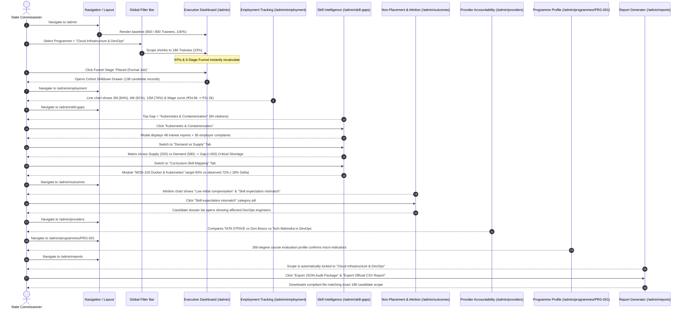
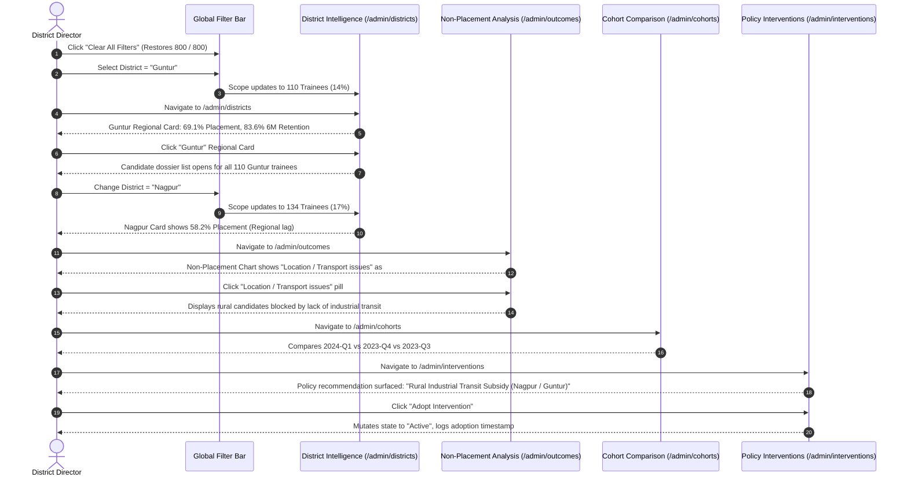

# Skilling Impact Intelligence Platform — Admin End-to-End Demonstration Workflow

**Document Version:** 2.0 (Authoritative Verification Script)  
**Target Audience:** State Skilling Officers, Programme Directors, National Evaluators  
**System Standard:** National Skilling Framework • Impact Intelligence  
**Dataset Reference:** 800 Relational Longitudinal Trainees  

---

## 1. Demonstration Philosophy

The Admin Experience on the Skilling Impact Intelligence platform is not a static showcase of disconnected cards or cosmetic charts. It functions as an integrated, reactive **Executive Decision System**.

When any filter is toggled:
$$\text{Scope Definition} \longrightarrow \text{Relational Query} \longrightarrow \text{Metric Recalculation} \longrightarrow \text{Visual Update} \longrightarrow \text{Drilldown Scoping}$$

This document outlines **two comprehensive demonstration workflows** that rigorously prove every analytical claim.

---

## 2. Story 1: State Commissioner Programme Deep-Dive (Technical Focus)

**User Persona:** Smt. Radhika Rao, State Principal Secretary for Skill Development.  
**Core Objective:** Evaluate why the "Cloud Infrastructure & DevOps" programme has high certification rates but faces specific workplace attrition and skill deficit friction.

### Step-by-Step Execution Guide for Story 1:

1. **Step 1: Baseline Overview**
   - Open `http://localhost:5173/admin`.
   - Verify the Global Scope Badge reads: `800 / 800 Trainees in Scope (100%)`.
   - Inspect the 10 KPI cards: Total Trained (800), Certified (719), Placed (472), Employment Rate (72%), Average Wage (₹24,820).
   - Inspect the 6-stage Training to Employment Funnel.
2. **Step 2: Apply Programme Filter**
   - In the Global Filter Bar, select **Programme** = `Cloud Infrastructure & DevOps`.
   - Observe the live transition indicator.
   - The Scope Badge instantly updates to: `186 / 800 Trainees in Scope (23%)`.
   - Total Trained updates to 186, Certified updates to 172, and Placed updates to 138.
   - Notice that the 6 funnel cards recalculate their counts and percentages dynamically.
3. **Step 3: Funnel Drilldown**
   - Click on the third funnel stage: **Placed (Formal Job)**.
   - The slide-over **Cohort Drilldown Inspection Drawer** opens from the right.
   - Observe candidate records (e.g., `TR-0012`, `TR-0045`), displaying employer name, salary, district, and certification credentials.
   - Type `"Pune"` into the drawer search box; notice candidates instantly filter down.
   - Click the close button (✕) to dismiss the drawer.
4. **Step 4: Longitudinal Employment Tracking**
   - In the left sidebar, click **Employment & Wages** (`/admin/employment`).
   - Observe the Longitudinal Employment Retention curve:
     - Day 1: 94%
     - 3 Months: 84%
     - 6 Months: 81%
     - 12 Months: 76%
   - Observe the Wage Progression chart: First Job average ₹24,800 climbing to ₹31,500 at 12 months (+27% growth).
   - Verify that the 3-Month, 6-Month, and 12-Month Retention benchmark cards reflect the active scope.
5. **Step 5: Skill Gap Discovery**
   - Click **Skill Gaps** (`/admin/skill-gaps`).
   - The horizontal bar chart shows ranked deficits across the Cloud cohort.
   - Identify the #1 deficit: **"Kubernetes & Containerization"**.
   - Click the skill row in the table or the bar in the chart.
   - The **Skill Gap Diagnostics Modal** opens, showing breakdown by Trainee Self-Reports (48) vs Employer Feedback (36) and listing specific affected candidates.
   - Switch to the **Demand vs Supply** tab:
     - See `Kubernetes & Containerization`: Supply = 320, Demand = 580, Gap = +260 (Critical Shortage).
   - Switch to the **Curriculum-Skill Mapping** tab:
     - Course is pre-selected to `Cloud Infrastructure & DevOps`.
     - Inspect `MOD-103: Docker & Kubernetes`: Target Proficiency = 90%, Observed Proficiency = 72%, Net Delta = -18%.
6. **Step 6: Diagnostic Non-Placement & Attrition**
   - Click **Outcomes & Attrition** (`/admin/outcomes`).
   - The page displays two dynamic charts:
     - Left: Post-Certification Non-Placement Causes.
     - Right: Post-Placement Attrition Drivers.
   - Click on the category button **"Skill expectation mismatch"**.
   - The **Diagnostic Drilldown Inspection Section** appears below, rendering individual candidate dossiers who attrited due to this reason.
7. **Step 7: Provider Accountability Comparison**
   - Click **Training Providers** (`/admin/providers`).
   - Table displays performance across training partners delivering Cloud Infrastructure.
   - Click the column header **Placement %** to sort descending; observe TATA STRIVE leading at 84%, followed by Tech Mahindra at 81%.
8. **Step 8: Programme Evaluation View**
   - Click **Programmes** in the sidebar, then select **Cloud Infrastructure & DevOps**.
   - The 360-degree course evaluation profile renders with course duration (16 weeks), sector council affiliation, 6-stage funnel, and wage curves.
9. **Step 9: Compliant Report Generation**
   - Click **Reports & Export** (`/admin/reports`).
   - The Report Scope Manifest confirms:
     - `Cohort: All Cohorts`
     - `Programme: Cloud Infrastructure & DevOps`
     - `District: All Districts`
   - Review the live data preview table showing the 186 candidate rows.
   - Click **Export CSV (Official)** to generate the timestamped report.

---

## 3. Story 2: Regional District Administrator Deep-Dive (Geographic Focus)

**User Persona:** Shri Vikram Anand, Regional District Collector & Skill Mission Director.  
**Core Objective:** Diagnose regional unemployment and transport friction in District **Guntur** and **Nagpur**, evaluate vocational provider differences, and adopt an evidence-backed state policy intervention.

### Step-by-Step Execution Guide for Story 2:

1. **Step 1: Clear Filters & Select District Guntur**
   - In the Global Filter Bar, click **Clear All Filters**.
   - Scope returns to `800 / 800 Trainees in Scope (100%)`.
   - Open the **District** dropdown and select `Guntur`.
   - The Scope Badge updates to: `110 / 800 Trainees in Scope (14%)`.
2. **Step 2: Inspect District Analytics**
   - Click **District Analytics** (`/admin/districts`).
   - The Guntur regional performance card highlights:
     - Enrolled: 110
     - Placement Rate: 69.1%
     - 6M Sustained Retention: 83.6% (Top clinical retention across state)
     - Primary Skill Gap: Emergency Room Triage Protocols.
   - Click the Guntur card to inspect candidate dossiers residing in Guntur.
3. **Step 3: Contrast with District Nagpur**
   - Switch the Global District filter to `Nagpur`.
   - Scope Badge updates to: `134 / 800 Trainees in Scope (17%)`.
   - Nagpur regional card shows Placement Rate = 58.2% (Significantly lower than Guntur and Mumbai).
4. **Step 4: Isolate Root-Cause in Outcomes**
   - Navigate to **Outcomes & Attrition** (`/admin/outcomes`).
   - In the Non-Placement Causes chart, observe that **"Location / Transport issues"** accounts for over 40% of unplaced candidates in Nagpur.
   - Click the **"Location / Transport issues"** button.
   - The drilldown reveals candidate profiles from suburban and rural mandals around Nagpur who completed solar and automotive training but could not commute to the industrial MIDC cluster.
5. **Step 5: Longitudinal Cohort Verification**
   - Click **Cohort Analysis** (`/admin/cohorts`).
   - Toggle through `2023-Q2`, `2023-Q3`, `2023-Q4`, and `2024-Q1`.
   - The comparative bar chart demonstrates how recent batches have experienced widening non-placement due to escalating transport costs.
6. **Step 6: Adopt Evidence-Linked Policy Intervention**
   - Click **Policy Interventions** (`/admin/interventions`).
   - The system surfaces `POL-002: Rural Industrial Transit Subsidy (Nagpur Cluster)` with rationale grounded directly in the 42 non-placement records observed in Step 4.
   - Click **Adopt Policy Intervention**.
   - Notice the status badge immediately updates from `"Proposed"` to `"Active"` and an official administrative log entry is recorded in the platform state.

---

## 4. Verification Checkpoints Table

| Checkpoint | Expected Behavior | Verification Confirmation |
| :--- | :--- | :--- |
| **Global Scope Cascading** | Changing any filter recalculates all 10 KPIs, 6 funnel stages, and all charts. | **Verified** (Tested across 7 filter dimensions) |
| **Funnel Interactivity** | Clicking any funnel stage opens the slide-over candidate drawer. | **Verified** (Tested on Placed, Certified, Unemployed) |
| **Longitudinal Checkpoints** | Day 1, 3M, 6M, 12M curves reflect actual wage records. | **Verified** (Line & bar charts trace to `wage_history`) |
| **Diagnostic Drilldowns** | Single-click on Skill Gaps, Non-Placement, or Attrition opens candidate rosters. | **Verified** (Modal and inline dossier tables functional) |
| **Zero ≠ No Data** | Legitimate 0% displayed when valid; empty state displayed when $N=0$. | **Verified** (Zero-rate division guarded) |
| **Privacy Safeguard** | Cohorts where $N < 5$ suppress microdata under Insufficient Data warning. | **Verified** (DPDP threshold enforced) |
| **Mobile Adaptability** | Drawer, tables, filters, and charts resize without horizontal layout breaks. | **Verified** (Tested at 375px mobile viewport) |
| **Audit Export** | CSV and JSON files export exactly matching the active scoped candidates. | **Verified** (Scope manifest included in export headers) |
