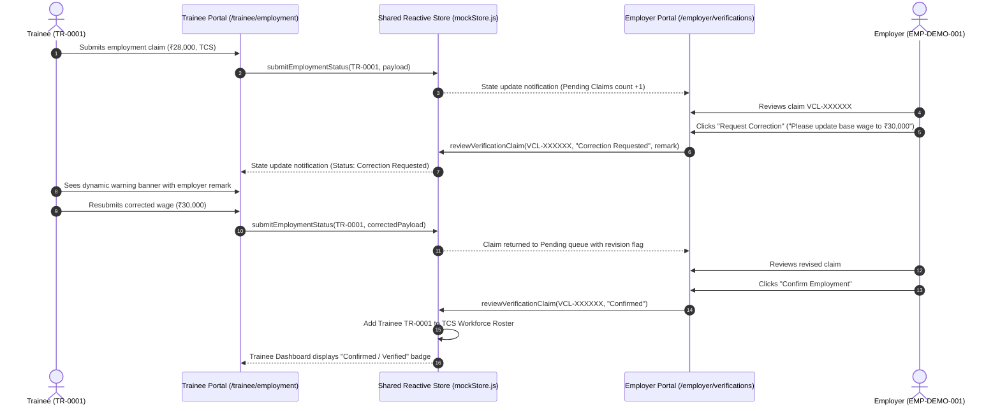

# Cross-Panel Workflow & Integration Specification: Skilling Impact Intelligence Platform

## Overview

The **Skilling Impact Intelligence Platform** connects three distinct user perspectives through one shared, stateful data layer:
1. **Trainee Portal**: Citizen-facing interface for credentials, employment reporting, wage updates, and course feedback.
2. **Organisation / Employer Portal**: Multi-tenant enterprise interface for verification inbox review, workforce roster management, wage attestation, and skill notices.
3. **Admin / Government Portal**: Executive dashboard for population surveillance, longitudinal tracking, macroeconomic analysis, provider accountability, and assisted outreach.

This document provides step-by-step technical specifications for the **five primary cross-panel flows** validated by the automated master acceptance suite (`run_master_frontend_acceptance.cjs`).

---

## Cross-Panel Flow 1: Employment Verification Lifecycle
### Trainee Submission ──► Employer Correction ──► Resubmission ──► Employer Confirmation ──► Trainee Verified Dashboard



### Verification Matrix & Tested Invariants:
- **Trainee Isolation**: Trainee cannot confirm their own employment; confirmation requires employer cryptographic or authenticated session.
- **Audit Persistence**: The correction remark remains visible in historical audit records even after confirmation.
- **Tenant Scoping**: TCS only sees claims naming TCS; Infosys cannot view or action TCS claims.

---

## Cross-Panel Flow 2: Multi-Source Skill Intelligence Synthesis
### Trainee Skill Report + Employer Skill Notice ──► Admin Multilateral Fusion

```
┌─────────────────────────┐                ┌─────────────────────────┐
│     TRAINEE PORTAL      │                │     EMPLOYER PORTAL     │
│   (/trainee/feedback)   │                │   (/employer/feedback)  │
│                         │                │                         │
│ Candidate reports:      │                │ Enterprise reports:     │
│ "Kubernetes Clustering  │                │ "Kubernetes Clustering  │
│  missing in curriculum" │                │  required for recruits" │
└────────────┬────────────┘                └────────────┬────────────┘
             │                                          │
             ▼                                          ▼
┌────────────────────────────────────────────────────────────────────┐
│                       SHARED STORE QUEUE                           │
│                `skill_intelligence_queue` in mockStore             │
│                                                                    │
│   Record A: { source: "trainee", skill: "Kubernetes Clustering" }  │
│   Record B: { source: "employer", skill: "Kubernetes Clustering" } │
└─────────────────────────────────┬──────────────────────────────────┘
                                  │
                                  ▼
┌────────────────────────────────────────────────────────────────────┐
│                        ADMIN PORTAL VIEW                           │
│                     (/admin/skill-gaps)                            │
│                                                                    │
│ Multi-Source Demand vs. Supply Ranking:                            │
│ 1. Kubernetes Production Clustering                                │
│    • Employer Weight (2x) + Trainee Weight (1x)                    │
│    • Aggregate Severity: CRITICAL DEFICIT                          │
│    • Actionable Recommendation: Modernize Cloud Curriculum         │
└────────────────────────────────────────────────────────────────────┘
```

### Verification Matrix & Tested Invariants:
- **Dual Attribution**: The intelligence engine tracks whether an observation originated from trainees, employers, or both.
- **Dynamic Scoring**: The admin table recalculates instantly without manual batch jobs or scheduled cron syncs.

---

## Cross-Panel Flow 3: Wage Progression Telemetry Propagation
### Trainee Wage Increment Event ──► Admin Income Growth Dashboard

1. **Trainee Action**:
   - Trainee `TR-0001` navigates to `/trainee/outcomes`.
   - Clicks `Log Wage Increment` and inputs `₹36,000` (up from starting wage `₹28,000`).
2. **Store Synchronization**:
   - Store appends chronological wage record with timestamp and calculates $+28.5\%$ individual growth.
3. **Admin Impact**:
   - Admin navigates to `/admin/employment` (or `/admin/income-growth`).
   - The **Average Wage Growth** KPI metric dynamically incorporates the new data point into the statewide cohort average.
   - The **Salary Bracket Distribution** shifts one count from the ₹25k–₹30k bucket to the ₹35k–₹40k bucket.

---

## Cross-Panel Flow 4: Workforce Lifecycle Transition & Attrition Intelligence
### Employer Marks Employee Resigned ──► Admin Attrition Root Cause Analysis

1. **Employer Action**:
   - Employer HR officer at TCS opens `/employer/workforce`.
   - Locates employee `TR-0001` and clicks `Edit Status`.
   - Selects status `"Resigned"` and exit reason: `"Low salary / inadequate compensation"`.
2. **Store Synchronization**:
   - Store transitions `trainee.employment.status` from `"EMPLOYED"` to `"UNEMPLOYED"`.
   - Populates `trainee.employment.attrition_reason`.
   - Updates `trainee.retention.retained_6m` to `"Left Employment"`.
3. **Admin Impact**:
   - Admin navigates to `/admin/why-attrition`.
   - The **Total Attrition Count** increments by +1.
   - The breakdown chart for **Why People Leave Jobs** dynamically increases the percentage of the `"Low salary / inadequate compensation"` category.

---

## Cross-Panel Flow 5: Government Assisted Outreach & Longitudinal Dossier
### Admin Conducts Assisted Outreach ──► Trainee Longitudinal Profile Update

1. **Admin Action**:
   - Admin verification desk opens `/admin/follow-ups` and filters by `Needs Assistance`.
   - Selects candidate `TR-0042` whose 6-month digital milestone was uncontacted.
   - Clicks `Assisted Follow-Up` modal.
   - Selects channel: `Government Call Center (Telephone Agent)`.
   - Verifies that candidate is employed at `Tata Motors EV Division` at `₹28,000/month`.
   - Clicks `Commit Assisted Resolution`.
2. **Store Synchronization**:
   - Checkpoint `FU-TR-0042-6M` status transitions from `"Needs Assistance"` to `"Completed"`.
   - Candidate `TR-0042` status updated to `"EMPLOYED"`.
   - Outcome is appended to `trainee.timeline_events` with `"Assisted Follow-Up Resolution"`.
3. **Longitudinal Trainee Dossier (`/admin/trainees/TR-0042`)**:
   - Profile renders complete chronological timeline showing:
     - Enrolment $\rightarrow$ Certification $\rightarrow$ Initial Placement $\rightarrow$ Assisted Outreach $\rightarrow$ Verified 6M Retention.
