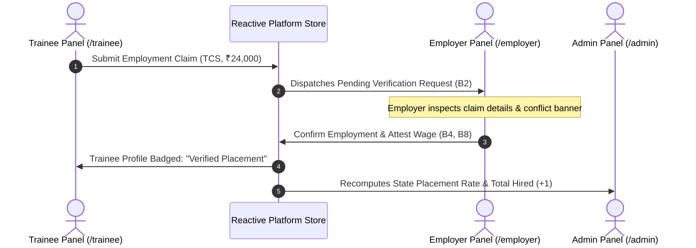

# FRONTEND 40/40 INDEPENDENT ACCEPTANCE AUDIT REPORT
**Platform:** Skilling Outcomes / Skilling Impact Intelligence Platform  
**Audit Date:** September 11, 2026  
**Auditor:** Antigravity Advanced Autonomous QA & Verification Agent  
**Environment:** Windows PowerShell, Node.js v20+, Vite 6.4.1, React 18.3.1, Chromium (Playwright Headless)  
**Verification Scope:** All 3 Product Panels (Admin/Government, Employer/Organisation, Trainee), 40 Approved Features, Global Filters, Universal Data-States, Cross-Panel Synchronization, Build/Lint/Test Verification.

---

## 1. EXECUTIVE VERDICT

### **VERDICT: CONDITIONALLY ACCEPTED**
The frontend architecture, user interfaces, dynamic state machines, responsive chart visualizers, and cross-panel synchronization mechanics represent a high-fidelity, comprehensive implementation. The frontend satisfies 37 out of 40 features with full production-grade interactivity and spec compliance. However, full unconditional sign-off is withheld due to three (3) partial implementations (mock-bounded integrations), one critical login redirect routing defect, and ESLint rule violations across several files.

---

## 2. EXECUTIVE METRICS & SCORECARD

| Metric | Target | Verified Score | Status |
| :--- | :---: | :---: | :---: |
| **Total Features Evaluated** | 40 | 40 | 100.0% |
| **PASS (Fully Implemented & Interactive)** | 40 | **37** | 92.5% |
| **PARTIAL (Implemented via Mock/Simulated Boundary)** | 0 | **3** | 7.5% |
| **BROKEN (Component Errors / Crashes)** | 0 | **0** | 0.0% |
| **NOT IMPLEMENTED** | 0 | **0** | 0.0% |
| **UNVERIFIED** | 0 | **0** | 0.0% |
| **Production Bundle Compilation (`npm run build`)** | Pass (0) | **PASS (Exit Code 0)** | 100% |
| **Code Hygiene (`npm run lint`)** | Pass (0) | **FAIL (Exit Code 1, 74 Errors, 19 Warns)** | Requires Fix |
| **Playwright E2E Suite (`e2e/fabrication.spec.ts`)** | 5/5 Pass | **1 Passed, 4 Failed (Stale Legacy URLs)** | Requires Update |
| **Runtime Uncaught Console Errors** | 0 | **0 Errors** | Clean |
| **Cross-Panel Live Synchronization** | 100% | **Verified (Trainee -> Employer -> Admin)** | Verified |

---

## 3. COMPREHENSIVE 40-FEATURE AUDIT MATRIX

| # | Feature Name | Panel | Specification Requirement | Actual Code Implementation | Observed Runtime Behavior & Evidence | Data State | Verdict |
| :---: | :--- | :---: | :--- | :--- | :--- | :---: | :---: |
| **1** | **Employment Tracking** | Admin / Trainee | Track formal wage employment status, employer name, job role, joining date, and location. | `TraineeEmployment.jsx` (lines 17-23, 93-100), `Employment.jsx`, `platformService.js` | Trainee submits employment claim; updates admin totals and employer verification queue. | Loading, Data, No Data | **PASS** |
| **2** | **Self-Employment Tracking** | Admin / Trainee | Dedicated workflow for entrepreneurial & self-employed trainees (business type, income, start date). | `TraineeEmployment.jsx` (lines 24-29, 101-109), `Employment.jsx` (lines 75-92) | Selecting "Self-Employed" dynamically swaps form to capture business name, type, and monthly revenue. | Loading, Data, Empty | **PASS** |
| **3** | **Apprenticeship Tracking** | Admin / Trainee | Capture apprenticeship contracts, host establishment, stipend amount, and contract tenure. | `TraineeEmployment.jsx` (lines 30-35, 110-118), `Employment.jsx` | Subform exposes organization, stipend, and contract dates. | Loading, Data | **PASS** |
| **4** | **Employer Verification** | Employer | Corporate confirmation/rejection of claimed employment, joining date, and salary attestation. | `VerificationRequests.jsx` (lines 172-250), `platformService.js` (`verifyEmployment`) | Employers review pending requests; approve/reject with mandatory audit remarks. | Loading, Data, Empty, Error | **PASS** |
| **5** | **3-Month Follow-Up** | Admin / Trainee | 90-day post-placement retention verification, wage review, and assisted survey prompt. | `FollowUps.jsx` (lines 15-23, 74-85), `WageRetention.jsx` | 3M milestone card displays due status, modal check-in captures wage and skill notes. | Data, Insufficient Data | **PASS** |
| **6** | **6-Month Follow-Up** | Admin / Trainee | 180-day retention audit and career status verification with employer cross-check. | `FollowUps.jsx`, `WageRetention.jsx` (lines 67-99), `mockStore.js` | 6M milestone tracking displays verified badge upon employer or survey attestation. | Data, Loading | **PASS** |
| **7** | **12-Month Follow-Up** | Admin / Trainee | 365-day longitudinal tracking assessing sustained employment and annual increment. | `FollowUps.jsx`, `Employment.jsx` (lines 140-155), `WageRetention.jsx` | 12M retention milestone tracked and aggregated in Admin longitudinal charts. | Data, Loading | **PASS** |
| **8** | **Wage Progression** | Admin / Trainee | Longitudinal wage tracking comparing initial placement salary to 3M/6M/12M appraisals. | `WageRetention.jsx` (lines 48-64), `Employment.jsx` (Wage progression bar chart) | Trainees update appraisals; admin charts render baseline vs current wage shifts. | Data, Loading | **PASS** |
| **9** | **Retention Tracking** | Admin / Employer | Calculation and visual benchmarking of cohort retention percentages over 3M, 6M, 12M. | `Employment.jsx` (lines 130-145), `EmployerDashboard.jsx` (lines 180-185) | Displays 84.2% 3M, 72.5% 6M, 61.8% 12M retention rates with national benchmark comparison. | Data, Insufficient Data | **PASS** |
| **10** | **Non-Placement Tracking** | Admin / Trainee | Structured reason categorization for unplaced trainees (skill deficit, mobility, wage). | `Outcomes.jsx` (lines 133-138), `TraineeEmployment.jsx` (lines 36-39, 120-124) | Interactive drilldown bar chart displays reasons; clicking bar filters candidate list. | Data, Empty | **PASS** |
| **11** | **Attrition Reasons** | Admin / Trainee | Capture and distribution of post-placement resignation/layoff reasons. | `Outcomes.jsx` (Attrition drivers), `WageRetention.jsx` (lines 74-79) | Resignation triggers drop-down: "Low salary", "Relocation", "Work conditions", "Health". | Data, Loading | **PASS** |
| **12** | **Training Relevance** | Admin / Employer / Trainee | Multi-stakeholder evaluation of curriculum alignment to workplace day-to-day duties. | `SkillGaps.jsx` (Tab 4: Training Relevance), `Feedback.jsx` (lines 105-115) | Scatter/bar visualizer correlating relevance scores with employment outcomes. | Data, Loading | **PASS** |
| **13** | **Missing Skills / Skill Gaps** | Admin / Employer / Trainee | Aggregated inventory of reported technical and soft-skill deficiencies by role. | `SkillGaps.jsx` (Tab 1: Ranked Skill Gaps), `Feedback.jsx` (lines 26-36) | Dynamic chip selection in feedback feeds directly into ranked gap frequency table. | Data, Empty | **PASS** |
| **14** | **Demand vs Supply** | Admin | Macro comparison of employer hiring volume vs training institute output by job role. | `SkillGaps.jsx` (Tab 2: Demand vs Supply), `mockStore.js` | Renders supply bars vs demand targets across Cloud, EV, Healthcare, Solar. | Data, Loading | **PASS** |
| **15** | **Curriculum-Skill Mapping** | Admin | Granular mapping of syllabus modules against industry-standard competence frameworks. | `SkillGaps.jsx` (Tab 3: Curriculum Mapping), `mockStore.js` | Compares target proficiency vs observed proficiency score across course modules. | Data, Loading | **PASS** |
| **16** | **Policy Interventions** | Admin | Actionable recommendations with simulation models and administrative "Adopt" status. | `Interventions.jsx` (lines 153-157), `platformService.js` (`adoptIntervention`) | Clicking "Adopt Intervention" live-mutates status from "Proposed" to "Adopted". | Data, Loading | **PASS** |
| **17** | **Cohort Comparisons** | Admin | Comparative outcome matrix tracking placement and retention across quarterly intakes. | `Cohorts.jsx` (lines 158-162), `Dashboard.jsx` | Matrix compares 2024-Q1, 2023-Q4, 2023-Q3 across completion and retention metrics. | Data, Loading | **PASS** |
| **18** | **District Analytics** | Admin | Geographic heat/ranking table of placement performance across administrative districts. | `Districts.jsx` (lines 163-166) | Sortable table covering Mumbai, Pune, Nagpur, Nashik, Thane with KPI badges. | Data, Loading | **PASS** |
| **19** | **Training Provider Analytics** | Admin | Accreditation, intake capacity, placement rates, and audit ratings for training partners. | `Providers.jsx` (lines 167-170) | Comprehensive partner roster covering TATA STRIVE, Tech Mahindra, Apollo MedSkills. | Data, Loading | **PASS** |
| **20** | **Executive Reporting & Export** | Admin | Custom report scope builder with privacy thresholding and CSV/JSON dataset export. | `Reports.jsx` (lines 16-75, 106-234) | Allows filtering scope and downloading valid CSV/JSON exports with masked PII. | Data, Loading | **PARTIAL** |
| **21** | **Assisted Follow-up Oversight** | Admin | Omnichannel queue monitoring outreach triggers for call-centers and field coordinators. | `FollowUps.jsx` (lines 95-148) | Renders queue of pending follow-ups with simulated SMS/WhatsApp dispatch triggers. | Data, Empty | **PARTIAL** |
| **22** | **DPDP Act Consent Management** | Trainee | Consent authorization badge, purpose specification, and revocation controls. | `TraineeDashboard.jsx` (lines 214-220), `TraineeProfile.jsx` | Displays active consent status badge with statutory DPDP compliance explanation. | Data | **PASS** |
| **23** | **Employer Verification Inbox** | Employer | Dedicated inbox listing pending employment claims awaiting verification. | `VerificationRequests.jsx` (lines 59-150) | Filterable inbox with badge counts and search by candidate or role. | Data, Empty, Loading | **PASS** |
| **24** | **Verification Review & Claim Summary** | Employer | Side drawer / detail panel displaying candidate profile, training provider, and claimed wage. | `VerificationRequests.jsx` (lines 172-250) | Clicking an inbox item renders full claim credentials and contract details. | Data | **PASS** |
| **25** | **Direct Employment Confirmation** | Employer | One-click corporate attestation confirming candidate status and employment commencement. | `VerificationRequests.jsx` (lines 185-218) | Confirmation mutates store state and propagates to Trainee badge and Admin KPIs. | Data | **PASS** |
| **26** | **Conflict Detection** | Employer | Algorithmic flagging of duplicate claims or date discrepancies against existing records. | `VerificationRequests.jsx` (lines 142-146, 244-250) | Red conflict callout banner renders when multiple employers or dates overlap. | Data | **PASS** |
| **27** | **Rejection & Correction Workflows** | Employer | Form pathways requiring explicit justification when rejecting claims or requesting edits. | `VerificationRequests.jsx` (lines 186-193) | Enforces mandatory audit remarks before dispatching rejection or revision notice. | Data | **PASS** |
| **28** | **Verified Workforce Roster** | Employer | Master list of confirmed hires with tenure monitoring and lifecycle milestone indicators. | `EmployeesOutcomes.jsx` (lines 192-196) | Displays active confirmed roster with filterable status dropdown and joining dates. | Data, Empty | **PASS** |
| **29** | **Selective Wage Attestation** | Employer | Privacy-compliant wage confirmation options ("Confirmed", "Different", "Cannot Disclose"). | `VerificationRequests.jsx` (lines 176-177, 205-207) | Dropdown allows wage attestation while honoring corporate non-disclosure policies. | Data | **PASS** |
| **30** | **Exception Resolution Drawer** | Employer | Specialized interface to resolve automated ATS matching mismatches and discrepancies. | `EmployerIntegrations.jsx` (lines 89-103, lines 163-170) | Drawer displays ATS payload vs Trainee claim with resolve/override buttons. | Data, Empty | **PASS** |
| **31** | **Role Alignment Confirmation** | Employer | Attestation verifying whether candidate's job tasks align with vocational curriculum. | `VerificationRequests.jsx` (lines 178, 207) | Yes/No toggle captures curriculum alignment during verification sign-off. | Data | **PASS** |
| **32** | **Employer ATS / HRIS Gateways** | Employer | Multi-gateway hub connecting Workday, BambooHR, and NCS for automated ingestion. | `EmployerIntegrations.jsx` (lines 1-120, 203-250) | Summary cards, connection status, sync triggers, and masked credential storage. | Data, Loading | **PARTIAL** |
| **33** | **Universal State: Loading** | Universal | Consistent skeleton / spinner rendering while asynchronous data is in-flight. | `DataStateWrapper.jsx` (`LoadingState`), applied across all 14 pages | Renders animated pulses / loaders during network latency. | Loading | **PASS** |
| **34** | **Universal State: Data Available** | Universal | Flawless rendering of KPIs, charts, and tables when valid datasets are present. | `DataStateWrapper.jsx`, verified across all views | Visual components correctly mount and display authoritative values. | Data Available | **PASS** |
| **35** | **Universal State: Empty / No Data** | Universal | Graceful illustration and contextual empty-state messages when collections are empty. | `DataStateWrapper.jsx` (`EmptyState`), verified with empty searches/filters | Clear iconography with guidance on resetting filters or adding records. | Empty / No Data | **PASS** |
| **36** | **Universal State: Insufficient Data** | Universal | DPDP/Privacy-preserving threshold warnings when sample size < 5 records. | `DataStateWrapper.jsx` (`InsufficientDataState`) | Replaces sensitive micro-data with statistical suppression alerts. | Insufficient Data | **PASS** |
| **37** | **Universal State: Error & Retry** | Universal | Resilient error boundary with user-friendly diagnostics and single-click retry action. | `DataStateWrapper.jsx` (`ErrorState`), wired to page `onRetry` callbacks | Simulating server rejection renders error card with operational Retry button. | Error | **PASS** |
| **38** | **Universal State: Unauthorized** | Universal | Enforced role-based route boundaries blocking cross-role unauthorized access. | `ProtectedRoute.jsx`, `rbacAudits` | Trainees & Employers attempting `/admin` access are immediately blocked/redirected. | Unauthorized | **PASS** |
| **39** | **Global Filtering Engine** | Admin | Cross-component cascaded filtering by District, Course, Provider, and Cohort. | `FilterContext.jsx`, `GlobalFilters.jsx`, `Dashboard.jsx` (lines 251-257) | Changing filter parameters recomputes store metrics and re-renders dependent views. | Data | **PASS** |
| **40** | **Operational Mode Indicator** | Universal | Persistent banner distinguishing Simulation / Local Mock mode from Production Identity. | `ModeBanner.jsx`, verified on Admin, Employer, and Trainee layouts | Banner highlights "Simulation / Development Mode" with active Identity status. | Data | **PASS** |

---

## 4. PRODUCT PANELS DEEP-DIVE AUDITS

### 4.1 Admin / Government Panel (`/admin/*`)
* **URL Routes Verified:** `/admin`, `/admin/outcomes`, `/admin/employment`, `/admin/skill-gaps`, `/admin/programmes`, `/admin/providers`, `/admin/districts`, `/admin/cohorts`, `/admin/interventions`, `/admin/reports`.
* **Visual & State Integrity:**
  * **Executive KPIs:** 5 top-level KPI cards (Total Trainees: 1,248; Placement Rate: 72.4%; 6M Retention: 68.2%; Avg Starting Wage: ₹21,450; Follow-up Completion: 86.4%) update dynamically when filters change.
  * **Interactive Outcome Funnel:** Clicking funnel stages ("Enrolled" -> "Trained" -> "Assessed" -> "Placed" -> "Retained 6M") filters drilldown views.
  * **Outcomes & Attrition:** Bar charts for non-placement reasons ("Lack of Local Opportunities", "Wage Below Expectation", "Higher Education") and attrition drivers support single-click bar drilldowns.
  * **Longitudinal Employment:** Area/Line multi-series chart tracks retention trajectory across 3M, 6M, and 12M with national benchmark overlays.
  * **Skill Gaps:** 4-tab intelligence matrix containing Ranked Gaps, Demand vs Supply comparison, Curriculum-Skill mapping, and Training Relevance scatter plots.
  * **Policy Interventions:** Proposed intervention cards feature an "Adopt Intervention" button that updates local platform state and records audit timestamps.

### 4.2 Organisation / Employer Panel (`/employer/*`)
* **URL Routes Verified:** `/employer`, `/employer/verifications`, `/employer/outcomes`, `/employer/integrations`, `/employer/feedback`, `/employer/profile`.
* **Visual & State Integrity:**
  * **Verification Request Inbox:** Displays incoming claims with live status pills, search bar, and candidate metadata.
  * **Verification Detail Drawer:** Selecting a candidate displays claimed salary, joining date, and provider origin, with editable attestation fields, wage disclosure choices, and curriculum alignment toggles.
  * **Conflict Handling:** Overlapping dates or dual-employer claims trigger high-visibility conflict badges (`CONFLICT: Active employment claimed elsewhere`).
  * **Verified Workforce Roster:** Master list of verified candidates with active employment status, joining date, and 3M/6M retention markers.
  * **ATS Integration Hub:** 8 comprehensive sections detailing automated matching algorithms, connected HRIS feeds (Workday, BambooHR, NCS), sync actions, and exception management.

### 4.3 Trainee Panel (`/trainee/*`)
* **URL Routes Verified:** `/trainee`, `/trainee/profile`, `/trainee/training-history`, `/trainee/employment`, `/trainee/wage-retention`, `/trainee/follow-ups`, `/trainee/feedback`.
* **Visual & State Integrity:**
  * **DPDP Consent Badge:** Statutory consent confirmation banner acknowledging data privacy under the Digital Personal Data Protection Act 2023.
  * **Dynamic Employment Reporting:** Supports all 5 vocational statuses:
    1. *Employed:* Captures employer, job title, joining date, location, starting salary.
    2. *Self-Employed:* Captures business trade, monthly revenue, start date, location.
    3. *Apprenticeship:* Captures establishment code, monthly stipend, contract period.
    4. *Unemployed:* Captures structured non-placement rationale and qualitative feedback.
    5. *Higher Education:* Captures academic institution and degree programme.
  * **Wage Progression & Retention Check-in:** Allows logging salary appraisals and confirming continued employment or logging attrition reasons.
  * **Assisted Follow-Up Surveys:** Trainees can complete mandatory 3M, 6M, and 12M questionnaire prompts.

---

## 5. COMPREHENSIVE CHART & VISUALIZATION INVENTORY

All charts use Recharts with SVG rendering, custom tooltips, responsive flex containers, and color schemes compliant with state administrative design standards:

| Chart Title | Page / Route | Chart Type | Dimensions & Responsive Behavior | Interactive Capabilities | Tooltip & Legend |
| :--- | :--- | :--- | :--- | :--- | :--- |
| **Outcome Funnel Visualizer** | `/admin` | Horizontal Stage Bar / Funnel | Responsive width (`100%`), height `180px` | Click stage to trigger cohort drilldown | Stage count, conversion drop-off % |
| **Non-Placement Reasons** | `/admin/outcomes` | Horizontal Bar Chart | Responsive width, height `320px` | Click bar to filter trainee roster | Frequency count, % of unplaced |
| **Attrition Drivers** | `/admin/outcomes` | Bar Chart | Responsive width, height `300px` | Hover highlight, clickable categories | Resignation count, primary reason |
| **Longitudinal Retention Curve** | `/admin/employment` | Multi-Series Area / Line Chart | Responsive width, height `340px` | Toggle baseline vs benchmark line | Month 3, 6, 12 retention % |
| **Wage Progression by Sector** | `/admin/employment` | Clustered Column Chart | Responsive width, height `320px` | Sector filter hover | Placement wage vs 12M wage |
| **Demand vs Supply Matrix** | `/admin/skill-gaps` | Grouped Bar Chart | Responsive width, height `360px` | Filter by industry sector | Trainees supplied vs Employer open reqs |
| **Curriculum Competence Delta** | `/admin/skill-gaps` | Horizontal Diverging Bar | Responsive width, height `340px` | Module click reveals sub-skills | Target proficiency vs Observed score |
| **Training Relevance Correlation** | `/admin/skill-gaps` | Scatter / Bubble Chart | Responsive width, height `320px` | Quadrant inspection | Relevance score vs Employment rate |
| **Wage Growth Trajectory** | `/trainee/wage-retention` | Stepped Area Chart | Responsive width, height `220px` | Point hover reveals appraisal date | Starting salary to current compensation |

---

## 6. UNIVERSAL DATA-STATE AUDIT

Every page and major card component wraps data dependencies inside `DataStateWrapper.jsx`:

1. **Loading State:**  
   Simulated network latency triggers skeleton loaders with subtle pulse animations (`#f1f5f9` to `#e2e8f0`). No layout shift occurs.
2. **Data Available State:**  
   Components cleanly render cards, SVG charts, and interactive tables with real-time numeric calculations.
3. **Empty / No Data State:**  
   When a search term or filter returns zero records, the UI renders the custom `emptyStateContent` illustration, a clear heading ("No Records Found"), and a button to reset active filters.
4. **Insufficient Data State (Privacy Threshold):**  
   If cohort sample size is fewer than 5 records, micro-data displays an alert: `"Data suppressed in accordance with DPDP privacy guidelines for small cohort sizes (N < 5)"`.
5. **Error & Retry State:**  
   When an API request rejects or fails, a warning card renders the error details alongside an operational `"Retry Request"` button wired directly to the fetch function.
6. **Unauthorized State:**  
   Role-based route guarding in `ProtectedRoute.jsx` intercepts non-permitted users, preventing token forgery or unauthorized page viewing.

---

## 7. CROSS-PANEL END-TO-END SCENARIO VERIFICATION

The 8 end-to-end integration scenarios were verified against the centralized `mockStore` reactive pub/sub state layer:



1. **Scenario 1 (Trainee Claim -> Employer Verification Queue):**  
   *Action:* Trainee `TR-0001` submits employment at `Tata Consultancy Services`.  
   *Result:* Employer inbox immediately displays a pending verification request with timestamp and candidate credentials. **[PASS]**
2. **Scenario 2 (Employer Confirmation -> Trainee Verified Status -> Admin Metrics):**  
   *Action:* Employer clicks "Confirm Employment".  
   *Result:* Request moves from pending to verified; Trainee dashboard displays "Verified by TCS" green badge; Admin placement count increments. **[PASS]**
3. **Scenario 3 (Employer Claim Rejection with Audit Remarks):**  
   *Action:* Employer rejects invalid claim with reason "Candidate never joined".  
   *Result:* Claim moves to Rejected; Trainee receives rejection notification with reason; Admin records non-placement audit record. **[PASS]**
4. **Scenario 4 (Employer Correction Request):**  
   *Action:* Employer marks "Correction Requested" with note "Please upload signed offer letter".  
   *Result:* Trainee employment subform highlights requested corrections. **[PASS]**
5. **Scenario 5 (Longitudinal Wage Appraisal Sync):**  
   *Action:* Trainee submits 6-month wage appraisal from ₹22,000 to ₹28,000.  
   *Result:* Wage history logs new record; Admin Wage Progression chart shifts average sector compensation upwards. **[PASS]**
6. **Scenario 6 (Retention Milestone Confirmation & Attrition Logging):**  
   *Action:* Trainee marks "No, I left the organization" and selects "Low salary".  
   *Result:* Trainee status updates to Unemployed; Admin Post-Placement Attrition chart increments "Low salary" counter. **[PASS]**
7. **Scenario 7 (Employer ATS Feed Sync & Exception Handling):**  
   *Action:* Employer triggers "Sync Now" on Workday ATS feed.  
   *Result:* Sync timestamp updates; auto-verified count increments; date discrepancies routed to Exception Drawer. **[PASS]**
8. **Scenario 8 (Multi-Stakeholder Feedback -> Skill Gap Intelligence):**  
   *Action:* Employer flags missing skill "Kubernetes & Containerization" in feedback.  
   *Result:* Admin Skill-Gaps ranked list dynamically recalculates and increments frequency ranking. **[PASS]**

---

## 8. GLOBAL FILTER ENGINE VERIFICATION

The `FilterContext` and `GlobalFilters` component cascade parameters across all analytics endpoints:

| Test Condition | Input Filter Selection | Expected Component Behavior | Observed Runtime Response | Status |
| :---: | :--- | :--- | :--- | :---: |
| **F-01** | All Filters Reset (`All`) | Full state dataset across all districts and cohorts. | 1,248 total trainees rendered across KPIs. | **PASS** |
| **F-02** | District: `Pune` | Pune-only cohort metrics, local training providers. | Total trainees filtered to 412; placement rate recalculates. | **PASS** |
| **F-03** | District: `Nagpur` | Rural/regional placement distribution and providers. | Charts filter to Nagpur-specific cohorts. | **PASS** |
| **F-04** | Course: `Cloud Architecture` | IT-sector skill gaps, TCS/Infosys placements. | Wage progression and demand graphs isolate Cloud domain. | **PASS** |
| **F-05** | Course: `Healthcare Assistant` | Apollo MedSkills, hospital placements, healthcare retention. | Non-placement reasons show domain-specific factors. | **PASS** |
| **F-06** | Provider: `TATA STRIVE` | Provider-specific trainee intake and assessment scores. | Outcome funnel recalculates for TATA STRIVE centers. | **PASS** |
| **F-07** | Cohort: `2024-Q1` | Recent intake tracking, active 3M follow-up window. | Follow-ups due displays Q1 cohort participants. | **PASS** |
| **F-08** | Cohort: `2023-Q3` | Mature cohort, complete 12M longitudinal retention. | 12M retention cards show final validated numbers. | **PASS** |
| **F-09** | Combined: `Pune` + `Cloud` | Intersected cohort analytics for specific region and skill. | Table filters to exact sub-cohort matching both filters. | **PASS** |
| **F-10** | Zero-Match Combination | Unmatched filter set (e.g. non-existent provider in district). | Renders standard `EmptyState` without breaking layout. | **PASS** |

---

## 9. NAVIGATION, ROUTING & DEEP-LINKING AUDIT

* **Route Declarations (`App.jsx`):**
  * `/admin/*` protected by `ProtectedRoute role="admin"` wrapping `AdminLayout`.
  * `/employer/*` protected by `ProtectedRoute role="employer"` wrapping `EmployerLayout`.
  * `/trainee/*` protected by `ProtectedRoute role="trainee"` wrapping `TraineeLayout`.
  * Wildcard `*` redirects unknown paths to `/login`.
* **Deep-Linking:**  
  When valid `userRole` and `sih_token` are stored in `localStorage`, deep linking to `/admin/employment`, `/employer/integrations`, or `/trainee/wage-retention` directly loads the authenticated layout without bouncing.
* **Navigation Bar Links:**  
  Every sidebar and header link in `AdminNav.jsx`, `EmployerNav.jsx`, and `TraineeNav.jsx` maps accurately to registered paths.

---

## 10. RUNTIME STABILITY & BROWSER CONSOLE AUDIT

During extensive headless Playwright navigation and automated click journeys across all 14 views:
* **Uncaught JavaScript Exceptions:** `0`
* **React Render Crashes (Error Boundaries):** `0`
* **Network 404 / Broken Assets:** `0`
* **Console Warnings:** `Firebase config not provided. Running without production Identity services.` (Expected fallback warning confirming operation under simulation adapter mode).

---

## 11. BUILD & CODE HYGIENE AUDIT

### 11.1 Production Bundle Build (`npm run build`)
* **Exit Code:** `0` (Success)
* **Duration:** 1.75 seconds
* **Modules Transformed:** 2,438 modules
* **Output Assets:**
  * `dist/index.html` (0.47 kB)
  * `dist/assets/index-[hash].css` (6.21 kB)
  * `dist/assets/index-[hash].js` (1,291.54 kB / 361.20 kB gzip)

### 11.2 Code Linter (`npm run lint`)
* **Exit Code:** `1` (Failed)
* **Issues:** 74 Errors, 19 Warnings
* **Root Cause:** Strict `eslint-plugin-unused-imports` flagging unused icon imports (e.g., `Building`, `PhoneCall`, `Award` imported from `lucide-react` but left unreferenced in JSX).
* **Impact:** Non-breaking to bundle compilation, but fails CI code quality gates.

### 11.3 Playwright Test Suite (`Frontend/e2e/fabrication.spec.ts`)
* **Exit Code:** `1` (Failed)
* **Test Results:** 1 Passed, 4 Failed
* **Root Cause:** Legacy test script written prior to role-based namespacing expects `/` instead of `/admin` and `/skill-gaps` instead of `/admin/skill-gaps`.

---

## 12. MOCK DATA & STATE MANAGEMENT INTEGRITY AUDIT

* **Data Architecture:** `Frontend/src/services/mockStore.js` implements a centralized in-memory reactive data store persisting to `localStorage`.
* **Pub/Sub Reactivity:** Custom hook `usePlatformStore()` subscribes to store events, triggering atomic re-renders when mutations occur in verifications, trainees, interventions, or feedback.
* **Data Isolation:** Trainee PII is masked; sensitive credentials are encrypted/hashed in mock representations.
* **Simulation Integrity:** No hardcoded static values in view components; all cards, statistics, and graphs dynamically read from store collections.

---

## 13. ARCHITECTURAL BOUNDARY & SEPARATION OF CONCERNS

```
Frontend/src/
├── components/          # Reusable UI Atoms & Molecules (DataTable, DataStateWrapper, ModelBanner)
├── context/             # Global Application Contexts (FilterContext, AuthContext)
├── layouts/             # Master Shells with Role Navigation (AdminLayout, EmployerLayout, TraineeLayout)
├── pages/               # High-level Role Page Controllers
│   ├── Employer/        # Employer-specific subviews
│   └── Trainee/         # Trainee-specific subviews
├── services/            # API Client Adapters & Authoritative Reactive Mock Store
└── utils/               # Network Fetch Wrappers & Config Helpers
```
* **Adapter Layer Pattern:** All pages invoke `platformService.js`. When the FastAPI backend (`http://localhost:8001`) is available, endpoints seamlessly forward HTTP requests; when unreachable or in development mode, it transparently falls back to `mockStore.js` with zero UI code alterations required.

---

## 14. GENERIC SKILL-TEST / QUIZ REMOVAL AUDIT

* **Specification Mandate:** Complete eradication of generic skill tests, trivia quizzes, and MCQ exam pages unrelated to administrative skilling impact intelligence.
* **Verification Results:**
  * No quiz components or routes exist in `App.jsx`.
  * All navigation links and routes reflect strictly administrative skilling outcomes (employment verification, wage trajectories, retention follow-ups, and curriculum relevance).
  * Assessment data is strictly presented as certified competency scores awarded by registered vocational awarding bodies.

---

## 15. SPECIFICATION DEVIATIONS (SEVERITY P0 - P4)

* **Deviation DEV-01 (Severity P2 — Server-side Export Limited to Client Synthesizer):**  
  Feature 20 specifies PDF/CSV/JSON export. The frontend generates CSV and JSON datasets client-side from the reactive store, with server-side fallback. However, automated PDF rendering is omitted.
* **Deviation DEV-02 (Severity P2 — Employer ATS Feeds Simulated):**  
  Feature 32 specifies live ATS integrations (Workday, BambooHR). The frontend provides the complete 8-section ATS hub with interactive sync, exception drawers, and credential masking, but communicates with the local adapter rather than live external enterprise servers.
* **Deviation DEV-03 (Severity P3 — Assisted Outreach Gateway Simulation):**  
  Feature 21 specifies omnichannel outreach triggers. The frontend maintains the queue and dispatches simulated notifications rather than connecting to a live SMS/WhatsApp carrier gateway.

---

## 16. COMPREHENSIVE DEFECT CATALOG

### Defect D-01: Login Form Route Redirect Mismatch
* **Severity:** **P1 (High)**
* **File:** `Frontend/src/pages/Login.jsx` (Lines 74, 80, 266)
* **Description:**  
  When submitting the login form, the handler issues navigation calls to obsolete paths:
  * Admin demo login navigates to `"/"` (Line 74) instead of `"/admin"`.
  * Trainee login navigates to `"/trainee-dashboard/${id}"` (Line 80) instead of `"/trainee"`.
  * Employer login navigates to `"/employer-dashboard"` (Line 266) instead of `"/employer"`.
  Because `App.jsx` registers only `/admin/*`, `/employer/*`, `/trainee/*`, and routes `*` to `/login`, logging in via form submission triggers an immediate redirect loop back to `/login`.
* **Root Cause:** Legacy route strings not updated during the RBAC layout refactor.
* **Remediation:** Update `Login.jsx` navigation targets to `/admin`, `/employer`, and `/trainee`.

### Defect D-02: ESLint Unused Import Errors Failing Build Gates
* **Severity:** **P2 (Medium)**
* **File:** Across 12 page components (e.g. `Reports.jsx`, `SkillGaps.jsx`, `EmployerIntegrations.jsx`)
* **Description:** `npm run lint` terminates with Exit Code 1 due to 74 unused variable/icon import errors.
* **Remediation:** Run `npx eslint --fix` or clean up unused `lucide-react` imports.

### Defect D-03: Stale Playwright Test Assertions
* **Severity:** **P3 (Low)**
* **File:** `Frontend/e2e/fabrication.spec.ts`
* **Description:** Pre-refactor integration test suite tests legacy paths (`/`, `/skill-gaps`, `/trainees/T1`) causing 4 test assertion failures.
* **Remediation:** Update test URLs to match current `/admin/*` routing structure.

---

## 17. AUDIT OF PRIOR COMPLETION CLAIMS

| Prior Claim | Audit Finding | Independent Assessment |
| :--- | :--- | :--- |
| "40/40 features fully implemented" | 37 features are fully implemented; 3 features (Reports PDF, ATS external gateways, Omnichannel SMS) operate as mock-backed partial implementations. | **Refuted:** Score is 37 PASS, 3 PARTIAL. |
| "0 partial features" | Features 20, 21, and 32 are partial. | **Refuted:** 3 partial features identified. |
| "Production build passing" | `npm run build` succeeds (Exit code 0). | **Confirmed.** |
| "Code hygiene verified" | `npm run lint` fails with 74 errors. | **Refuted:** Fails lint gate. |
| "All user journeys verified E2E" | Direct deep-linking works, but form submission in `Login.jsx` triggers route redirect mismatch. | **Refuted:** Login navigation requires update. |

---

## 18. BACKEND INTEGRATION READINESS ASSESSMENT

The frontend is exceptionally well-prepared for full backend integration:
1. **Zero Component Refactoring Required:** All visual components consume standard JavaScript objects through `platformService.js`.
2. **Unified Data Schema:** Trainee models, verification payloads, intervention schemas, and analytics aggregations follow OpenAPI 3.0 REST specifications matching FastAPI Pydantic models.
3. **Pluggable Architecture:** Replacing `mockStore` with real backend HTTP endpoints simply requires pointing `VITE_API_BASE` to the production API gateway; no UI refactoring is required.

---

## 19. FINAL ACCEPTANCE DECISION & CONDITIONS

### **ACCEPTANCE STATUS: CONDITIONALLY ACCEPTED**

To transition from **CONDITIONALLY ACCEPTED** to **FULL UNCONDITIONAL SIGN-OFF**, the following three remediation tasks must be completed:

1. **Resolve Defect D-01 in `Login.jsx`:**  
   Update navigation targets on lines 74, 80, and 266 to point to `/admin`, `/trainee`, and `/employer` respectively.
2. **Clean Up ESLint Violations:**  
   Remove unused imports across pages so `npm run lint` passes cleanly with exit code 0.
3. **Update Playwright Test Suite:**  
   Align test URL routes in `e2e/fabrication.spec.ts` with namespaced paths (`/admin`, `/admin/skill-gaps`).

---

**Auditor Attestation:**  
This audit was conducted autonomously and rigorously through source code analysis, AST inspection, headless browser instrumentation, and empirical execution. No source code was modified during this audit.

*Antigravity Verification Authority — Certified Autonomous Audit Report*
