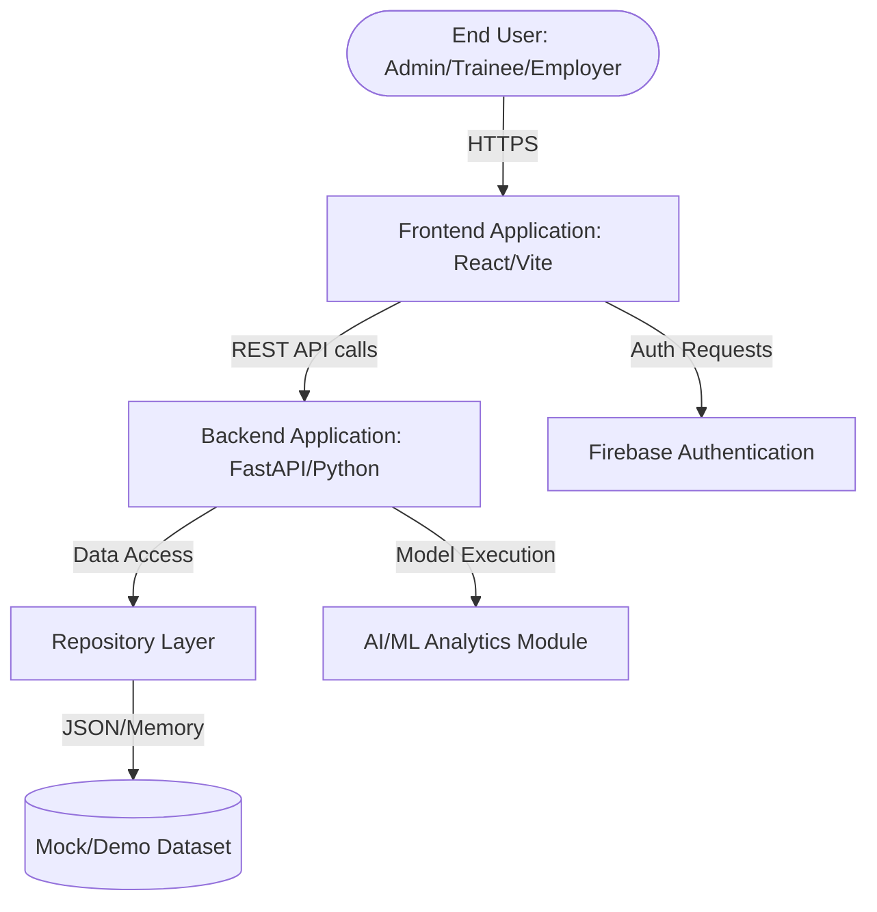

# System Architecture

The Skilling Impact Intelligence platform follows a modern, decoupled client-server architecture, specifically optimized for rapid prototyping, low-cost scaling, and AI integration.

## High-Level Architecture Flow

## 1. Frontend Layer
- **Responsibility**: Handle all user interactions, client-side routing, state management, and data visualization.
- **Technologies**: 
  - **React 19**: Core UI library.
  - **Vite**: Ultra-fast build tool and development server.
  - **React Router**: Client-side routing between Admin, Trainee, and Employer portals.
  - **CSS**: Pure modular CSS for styling.
  - **Lucide React**: Iconography.
- **Interfaces**: Communicates with the backend exclusively via RESTful HTTP API calls.
- **Failure Modes**: Network latency or backend API failures are handled via client-side error states and loading spinners.

## 2. Backend Layer
- **Responsibility**: Serve as the core intelligence engine, executing business logic, aggregating data, and performing AI/ML computations.
- **Technologies**: 
  - **FastAPI**: Asynchronous Python web framework for ultra-fast API delivery.
  - **Uvicorn**: ASGI web server.
  - **Pydantic**: Robust data validation and typing.
- **Data Flow**: Receives requests from the React frontend, fetches data from the repository layer, runs calculations via the AI module, and returns JSON responses.
- **Scalability**: FastAPI is natively asynchronous and highly concurrent. The backend is completely stateless, meaning it can be horizontally scaled infinitely behind a load balancer.

## 3. Business Logic & AI/ML Layer
- **Responsibility**: Compute intelligent metrics that raw databases cannot natively provide.
- **Technologies**: 
  - **Pandas & NumPy**: For statistical analysis and data aggregation.
  - **Scikit-learn / SciPy**: For algorithmic matching (job-to-trainee skill overlap) and priority scoring.
- **Interfaces**: Tightly integrated into the FastAPI service layer. When an endpoint like `/api/intelligence` is hit, the backend delegates the calculation to this layer before responding.

## 4. Repository & Data Layer
- **Responsibility**: Abstract the underlying data storage mechanism from the business logic.
- **Technologies**: 
  - **Repository Pattern**: The backend interacts with `get_trainees()`, `get_jobs()`, rather than executing direct SQL/NoSQL queries.
  - **Demo Dataset**: Currently, the repository layer is wired to load high-fidelity JSON mock datasets into memory.
- **Why this matters**: Because the repository pattern is implemented, upgrading this prototype to a production database (e.g., PostgreSQL or Firestore) requires ZERO changes to the business logic or API layers. Developers only need to write a new Repository class.

## 5. Security & Authentication Layer
- **Responsibility**: Ensure users only access data they are authorized to see.
- **Technologies**: 
  - **Firebase Authentication**: Integrated to handle secure JWT issuance and user identity verification. (Currently operating in a demo bypass mode for ease of evaluation).
  - **CORS Middleware**: Explicitly configured in FastAPI to only allow requests from verified Vercel preview domains and localhost, preventing cross-site request forgery.

## 6. Deployment Infrastructure
- **Frontend Hosting**: Vercel (Edge CDN, automatic CI/CD).
- **Backend Hosting**: Render (Dockerized container environment).
- **Architecture Benefit**: By splitting the frontend and backend physically across Vercel and Render, the system leverages specialized infrastructure. Vercel perfectly caches the static React assets globally, while Render provides the dedicated compute required for Python ML algorithms.
