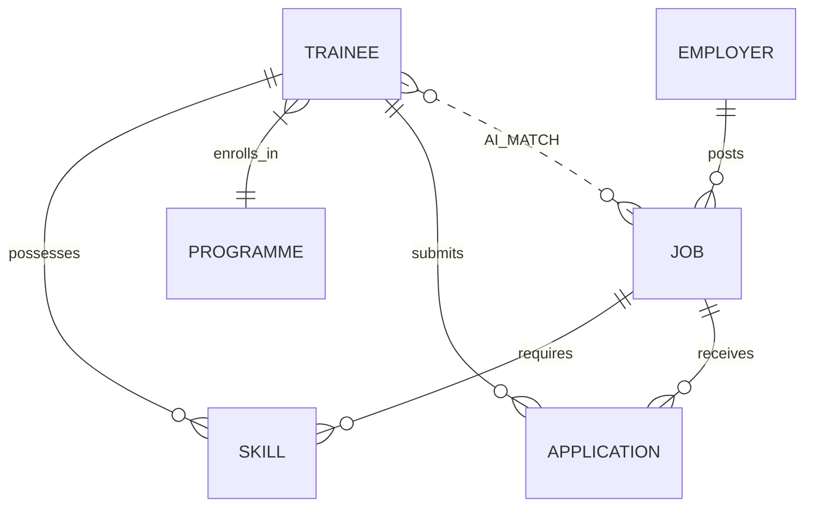

# Data Architecture

The Skilling Impact Intelligence platform implements a decoupled data architecture to facilitate rapid prototyping while maintaining a clear upgrade path to production databases (e.g., Firestore or PostgreSQL).

## 1. Core Entities

The system revolves around four primary entities:

### Trainee
- **Description**: An individual undergoing or having completed a skilling programme.
- **Key Fields**: `id`, `name`, `district`, `programme_id`, `cohort`, `skills` (array of objects), `status` (In Training, Placed, Dropped), `outcome_data`.

### Job
- **Description**: An employment requisition posted by an employer.
- **Key Fields**: `id`, `employer_id`, `title`, `required_skills` (array of strings), `location`, `salary_range`, `status`.

### Employer
- **Description**: A corporate entity seeking to hire trainees.
- **Key Fields**: `id`, `name`, `industry`, `active_jobs`.

### Programme
- **Description**: A specific training curriculum (e.g., "Data Analytics Specialist").
- **Key Fields**: `id`, `name`, `target_skills`.

---

## 2. Entity Relationships (Data Flow)



**Data Flow Context**:
The core value of the platform is derived from the **AI_MATCH** relationship. The system dynamically computes the intersection of a `TRAINEE`'s possessed skills and a `JOB`'s required skills to generate a `match_percentage` and a `skill_gap` array.

---

## 3. Data Source Strategy (Demo Mode vs. Persistent)

### The Demo Dataset
Currently, the prototype runs on a **Mock/Demo Dataset**.
- **Implementation**: High-fidelity JSON fixtures are stored locally. The backend `DemoRepository` loads these fixtures into memory upon startup.
- **Why**: Allows instant evaluation by judges without requiring database credentials, network connectivity to a DB, or complex data migrations.

### Firebase Integration (Configured)
- **Status**: The frontend contains a `firebase-config.js` file, and the backend lists `firebase-admin` in its requirements.
- **Usage**: Firebase is intended to handle JWT Authentication and potentially act as the NoSQL data store (Firestore) for production. However, in the current evaluated commit, Firebase data calls are intentionally bypassed in favor of the Demo Mode to ensure stable judging.

## 4. Repository Abstraction Pattern

The backend utilizes a strict Repository Pattern to isolate business logic from database logic.

```python
# Conceptual Architecture implemented in the Backend
class BaseRepository(ABC):
    def get_trainees(self, district=None, programme=None): pass

class DemoRepository(BaseRepository):
    # Loads from local JSON files
    def get_trainees(self, district=None, programme=None):
        return [t for t in self.mock_data if match(t, district, programme)]

# When upgrading to production, developers simply implement:
class FirestoreRepository(BaseRepository):
    # Loads from live Cloud Firestore
    def get_trainees(self, district=None, programme=None):
        # actual DB queries
```

This ensures the AI analytics layer never cares *where* the data comes from, only that it matches the Pydantic schema.
